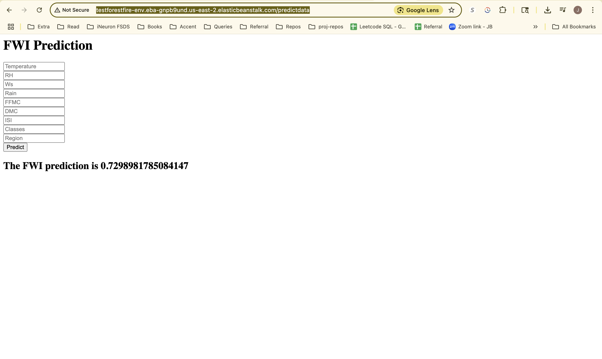

# Predicting Forest Fires using Linear, Lasso, Ridge, and ElasticNet Regression

This project uses machine learning to predict the **Fire Weather Index (FWI)** using the **Algerian Forest Fire Dataset**. After experimenting with several regression models, **Ridge Regression** produced the best results. The model and scaler were saved using `pickle` and integrated into a lightweight **Flask web app** for interactive predictions.

---

## Features

* Trained and evaluated multiple regression models: Linear, Lasso, Ridge, ElasticNet
* Best-performing model: **Ridge Regression**
* Models and Scaler serialized with `pickle`
* Flask web app for real-time FWI predictions
* Feature correlation filtering for cleaner model training
* Visualizations for model evaluation and scatter plots

---

## Project Structure

```
.
├── application.py                  # Flask application
├── models/
│   ├── ridge.pkl           # Trained Ridge Regression model
│   └── scaler.pkl          # Standard Scaler
├── notebooks/
│   ├── Model Training.ipynb      
├── templates/
│   ├── index.html          # Landing page
│   └── home.html           # Prediction form and result
├── Algerian_forest_fires_cleaned_dataset.csv
└── README.md
```

---

## Machine Learning Workflow

1. **Data Cleaning & Preprocessing**

   * Encoded target (`Classes`) as binary
   * Removed highly correlated features (threshold = 0.85)
   * Applied StandardScaler

2. **Model Training**

   * Compared Linear, Ridge, Lasso, and ElasticNet models
   * Evaluated using **Mean Absolute Error** and **R² Score**

3. **Model Selection**

   * Ridge Regression gave the best performance
   * Saved `ridge.pkl` and `scaler.pkl` for deployment

---

## 🖥 Web App Demo

The Flask app allows users to input 9 features and get a real-time FWI prediction.

### `Home Page`

User form for entering prediction data:


### `Prection Page`



---

## How to Run

1. **Install dependencies** (Install flask, pandas, scikit-learn, numpy)

   ```bash
   pip install -r requirements.txt
   ```

2. **Run Flask App**

   ```bash
   python application.py
   ```

---

## Dataset

* **Source**: Algerian Forest Fires Dataset (UCI Repository / Public)
* **Target**: FWI (Fire Weather Index)

